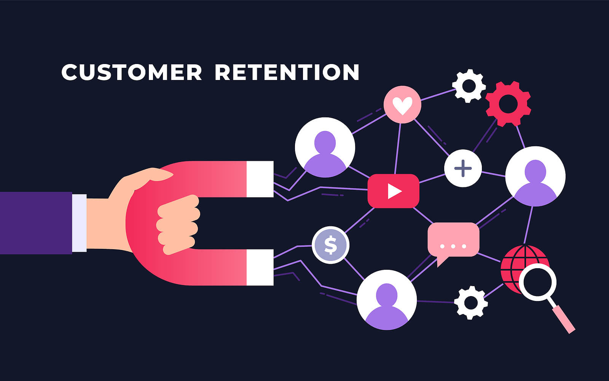
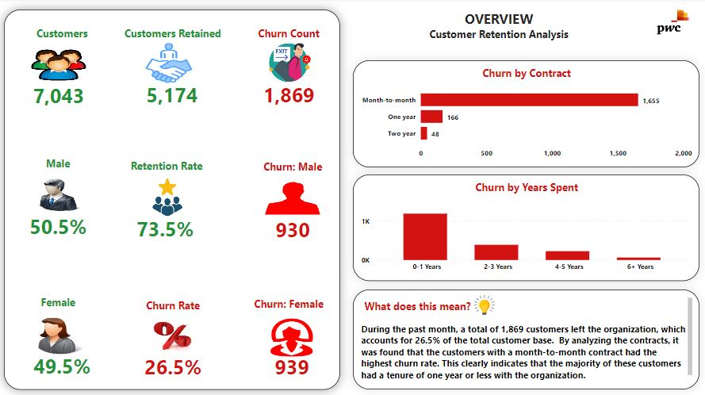
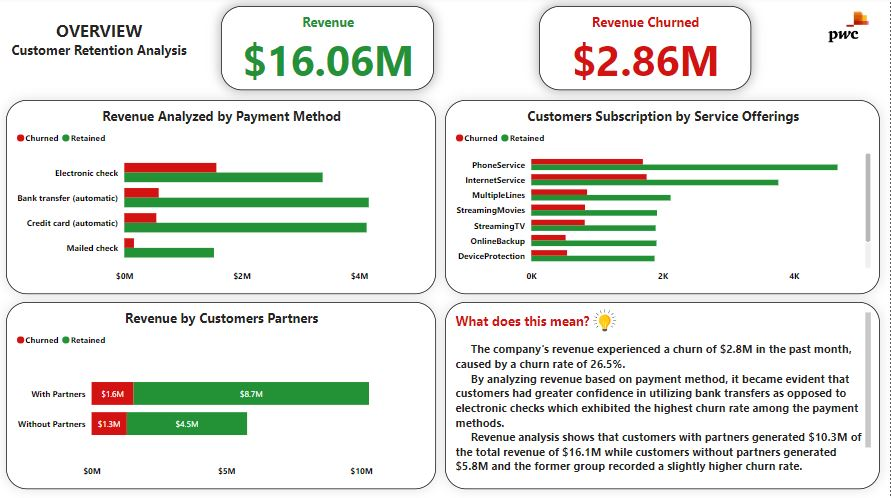
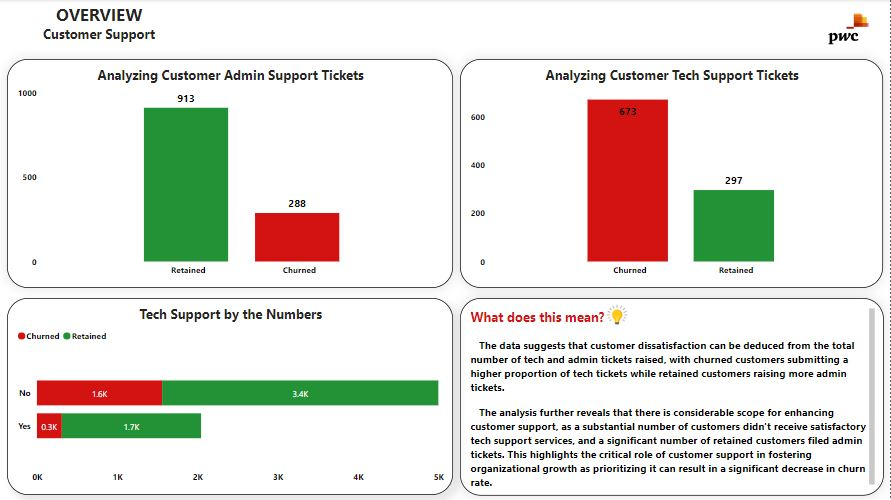

# Phone Now Customer Retention Analysis

## Introduction
As part of the PWC Switzerland and Forage Virtual case experience, we initiated a project that involved utilizing Power BI to establish relevant key performance indicators and scrutinize customer retention data for **Phone Now's** retention manager. Subsequently, an email was sent to the engagement partner, outlining the findings and recommendations.

## Data Sourcing
Data was provided by the PWC team in which it was loaded into Power BI

## Data Modelling
No relationships were required to be established since the data was in the form of a single-table Excel file.

## Email and Visuals
To aid comprehension, a brief note on the findings has been included in each dashboard. The dashboards consist of three visuals that analyze various metrics on customer retention data. For data interaction click [here](https://app.powerbi.com/links/ZfMyh-4TWd?ctid=f2c35211-7dad-42d6-b895-25d82fc1f0a2&pbi_source=linkShare&bookmarkGuid=4f956b3e-d80f-49a2-87ff-ff226c86a643)

### 1.
___

### 2.
___

### 3.
___

## Email

**Dear Engagement Partner,**

I hope this email finds you in good health. As we aim to expand and develop our business, I would like to share an update regarding our analysis. Our analysis has demonstrated that customers who feel valued and supported are more likely to remain loyal to our brand. Consequently, we have identified several initiatives to enhance our customer support and service offerings. Please refer to the brief notes in each dashboard for our findings.

Our first initiative is to provide our customer support team with the necessary skills and knowledge to provide an exceptional customer experience. We plan to achieve this by providing them with training. Investing in our team's development will pay off in terms of customer retention, as satisfied customers are more likely to remain loyal and recommend our brand.

To make it easier for customers to reach us, we aim to introduce innovative ways to enhance our support channels. This includes features such as a chatbot on our website, extended support hours to accommodate different schedules, and possibly implementing a self-service portal for customers to address common issues.

In order to cultivate long-lasting relationships with our customers, we suggest implementing a customer loyalty program to reward and incentivize our most loyal customers. This program will not only strengthen our relationships with our existing customers but also attract new ones seeking a personalized and rewarding experience.

By focusing on these initiatives, we believe that we can improve our customer retention rates and achieve long-term business growth. If you have any questions or concerns, please do not hesitate to contact me. Thank you for your continuous support and commitment to our customers.

**Kind regards,**

**Meggison Toritse,**

**Senior Data Analyst.**

